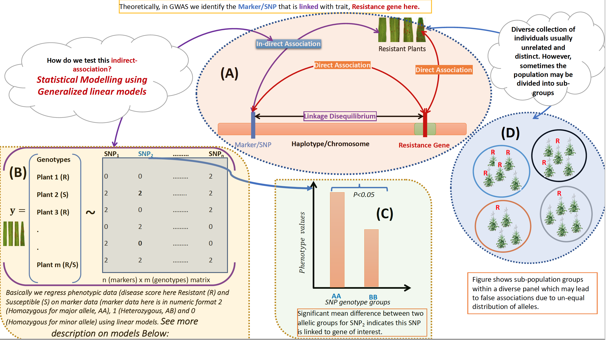
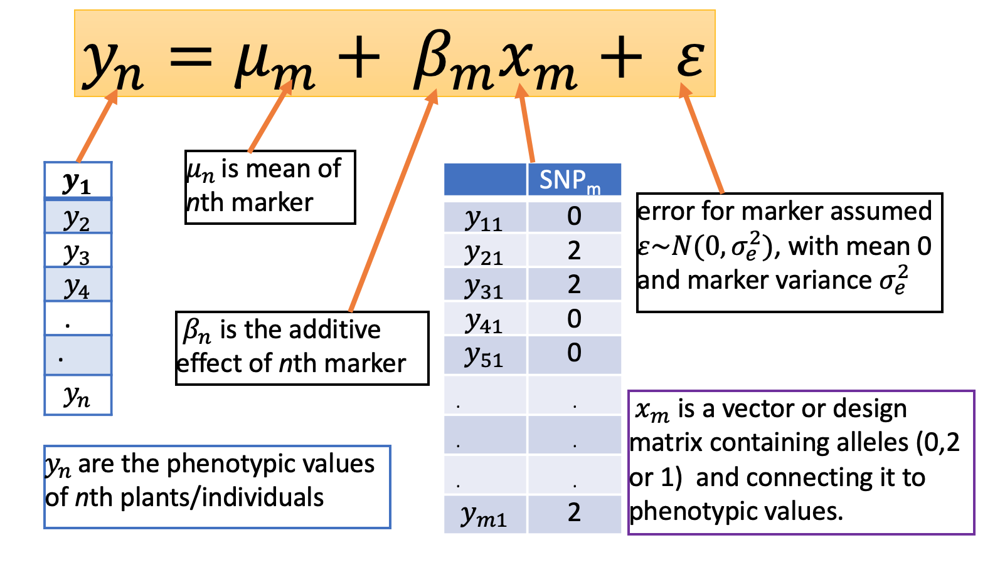
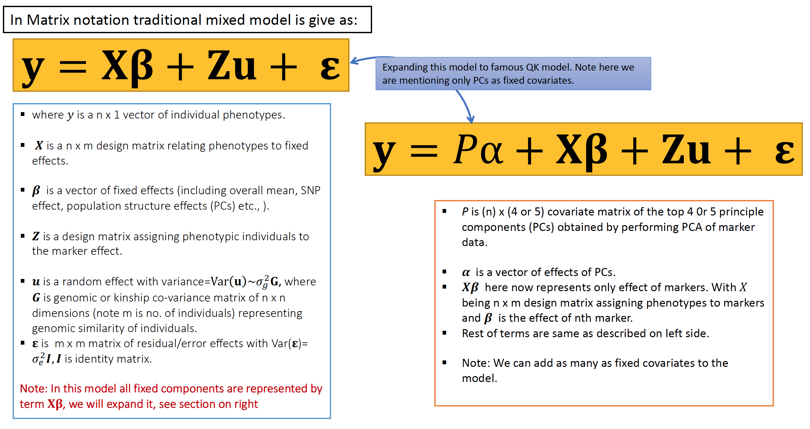
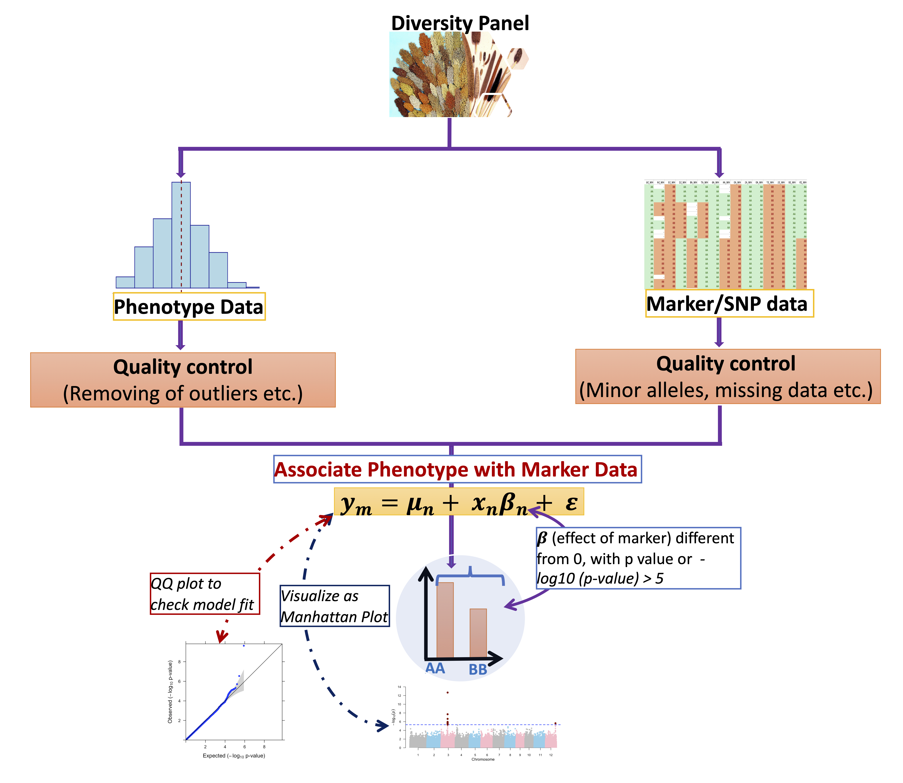

<style type="text/css">

body 
{
   font-size: 18px;
} 
code.r{
  font-size: 18px;
} 
pre {
  font-size: 18px
}

h1.title 
{/* Header 1 */
  font-size: 40px;
  font-family:  "Times New Roman", Times, serif;
  color: black;
   background-color:white;
  text-transform: Capitalize;
} 
h1 { /* Header 1 */
  font-size: 30px;
  font-family: "Times New Roman", Times, serif;
  color: black;
  background-color:#FFF0F5;
  text-transform: none;
} 
h2 { /* Header 2 */
  font-size: 25px;
  font-family: "Times New Roman", Times, serif;
  color: darkblue;
  text-transform: none;
} 
h3 { /* Header 3 */
  font-size: 22px;
  font-family: "Times New Roman", Times, serif;
  color: DarkRed;
  text-transform: none;
} 
h4 { /* Header 4 */
  font-size: 18px;
  font-family: "Times New Roman", Times, serif;
  color: Darkred;
  text-transform: none;
} 

</style>

```{r knitr_init, echo=FALSE, cache=FALSE}
library(knitr)
## Global options
options(max.print="100")
opts_chunk$set(echo=TRUE,
               cache=TRUE,
               prompt=TRUE,
               collapse=FALSE,
               comment=NA,
               strip.white=TRUE,
               message=FALSE,
               warning=FALSE,
               width=65,
               tidy.opts=list(width.cutoff=65, tidy=TRUE))
```

```{r setup, include=FALSE, echo=FALSE}
  require("knitr")
  opts_knit$set(root.dir = "~/Documents/GitHub/RforPlantBreeding/GWAS_in_R")
```


***
# Introduction
***

## Theory

* Genome-wide Association mapping (GWAS) is a an approach to determine if a genomic region or gene is associated with observed trait of interest using a diverse population. For more on GWAS check these Review Papers [Paper 1](https://www.ndsu.edu/pubweb/~mcclean/plsc731/homework/papers/nordborg%20and%20weigel%20-%20next%20generation%20genetics%20in%20plants.pdf), [Paper 2](https://dl.sciencesocieties.org/publications/tpg/abstracts/1/1/5), [Paper 3](https://www.sciencedirect.com/science/article/pii/S1369526609001800), [Paper 4](http://www.plantcell.org/content/21/8/2194?papetoc=#ref-17), [Paper 5](From phenotypes to causal sequences: using genome wide association studies to dissect the sequence basis for variation of plant development), [Paper 6](https://www.annualreviews.org/doi/abs/10.1146/annurev-arplant-050213-035715) and [Paper 7](http://clavius.bc.edu/~marth/BI820-2004S/files/Cardon-Assoc-NRG-2001.pdf).

* The GWAS is build on a hypothesis that a desirable phenotypes (For example, individuals resistant to particular disease here) is due to the genetic variants or genomic regions that are tightly linked (high Linkage Disequilibrium (LD)) with genetic markers/SNPs.

* The chance with which gene/genetic variant may be identified depends upon the LD between the marker and genetic variant. To know more about LD check these papers: [Paper 1](10.1146/annurev.arplant.54.031902.134907), [Paper 2](http://www.plantcell.org/content/15/7/1502) and [Paper 3](https://www.genetics.org/content/209/3/629).

* Population structure (PS) including sub-grouping, family relationships or cryptic relatedness may cause spurious associations (see figure below) in GWAS. To account for population structure Principle components (PC) (top 4 or 5 PCs) of marker data are used a fixed co-variates in GWAS model or Kinship matrix (pairwise genomic similarity of Individuals) of marker data as random effect to account for PS.  Further reading on PS concept in GWAS please check these papers: [Paper 1](https://www.nature.com/articles/nrg2813), [Paper 2: Box4](https://www.nature.com/articles/nrg1916), [Paper 3: Figure 2](https://www.sciencedirect.com/science/article/pii/S1369526609001800?via%3Dihub). For details on how to model PS in GWAS and resources on that see the **Principle Component Analysis** section Below for more details.

**The exemplary schematic representation of GWAS workflow is shown below:**


***Figure: A schematic view of (A) GWAS concept, (B) how to model GWAS statistically, (C) identify significant SNP which is in LD with gene of interest, and (D) concept of population structure. In (A) an hypothetical example of single SNP which is linked to gene (disease resistant here) on a particular haplotype and or chromosome. Resistant gene (highlighted in red) is having a **Direct Association** with plants that are resistant and also with the SNP (high lightened in light blue) which is tightly linked (high LD) with gene. In reality we can not observe gene directly (gene has **Direct Association** with plant resistance or phenotype but is un-observed) but can observe the SNP through genotyping. If the SNP is in high LD with gene, it means we are indirectly observing or identifying a gene. We exploit  the association between SNP and gene through statistical modelling (B). Basically in this we simply regress the phenotypic data on marker genotypes (SNPs here) using generalized linear models. Then the probability of distributions or mean differences between allelic groups is tested statistically against the null hypothesis (the distributions or means are equivalent) using appropriate test. For example, in (C) that shows the difference in mean values of two allelic groups (AA or 2 or TT) and (BB or 0 or CC) for $SNP_{2}$. The difference in mean indicates that  $SNP_{2}$ is linked to gene of interest, as shown in bar plot. Note for each SNP we have allelic groups AA i.e homozygous for major allele and BB that is homozygous for minor allele. AA and BB in matrix file (B) is represented as 2 and 0 and in nucleotide format it can be TT (2) or GG (2) and CC (0) or AA (0). When we use diverse collection of genotypes/lines (usually above 150) then it is possible it may be classified into sub-populations which may lead to spurious associations if not corrected. For example, in (D) a hypothetical population is divided into four sub-population. If disease resistance (shown as R colored in dark-red in figure) is common in one sub-group (gray color circle), then this un-even distribution  may show a positive association in GWAS analysis which is false because it is simply  over-representation of alleles or increase in allele frequency in one group not the cause.***

## Statistical Models for GWAS

* Here in this section I will provide description about Uni variate GWAS (fit a single trait at a time independent of other traits) models. Further reading [Paper](https://www.g3journal.org/content/9/9/2963.long)

* The models for GWAS can be divided into (a) Single marker Analysis and (b) Multi-marker analysis (whole genome regression analysis). In single marker analysis one marker/SNP is fitted at a time and in Multiple marker analysis all the markers are fitted simultaneously. Further reading [Paper](https://www.arch-anim-breed.net/60/335/2017/aab-60-335-2017.pdf).

* In this section and tutorial **Single Marker Analysis** (fitting one marker/SNP at a time)  will be demonstrated. Multiple marker analysis and multi-trait analysis will be discussed in next tutorial.
* 

### Single Marker Analysis Models


**Generalized Linear Model: Model 1**

* This is basic model fitting each SNP independently and ***without accounting population structure***. 

* For simplicity I will be showing model description for one marker (***n=1***).



* In the model or below models association between marker and phenotype is done by testing $\beta{_j}$, being different from 0, which results in an error probability or p value.

**Generalized Linear Model: Model 2**

* This is again basic model fitting each SNP independently and but this time ***accounting for population structure*** ( using principle components (PC,s) as fixed covariates in the model to account for PS).

* The model is same except we are adding PCs details. See the model description below:


* Top four or five PC,s are used in the model as fixed co-variates to account for PS.

* Principle components are obtained by performing **Principle Component Analysis** on G matrix as shown in Figure above. Further reading on G matrix or Kinship matrix [Paper 1](https://www.sciencedirect.com/science/article/pii/S0022030208709901?via%3Dihub) and [Paper 2](https://www.g3journal.org/content/3/5/909).

**Note: This model only accounts for PS arising due to sub-grouping (un-even allele distribution), it does not account for family relationships. To effectively account for PS mixed-models are more effective.**

**Mixed Linear Model (MLM): Model 3**

* Mixed-model is a powerful approach to PS , family structure and cryptic relatedness.

* In mixed model data is modelled using a mixture of fixed effects (environmental variables, PCs etc.) and random effects (as Kinship/G matrix). 

* Mixed Model description is given below:


* The model described above is the traditional mixed model (left in figure), and expanded to famous [Q+K model (Yu et al. 2006)](https://www.nature.com/articles/ng1702) (right) and mostly used in GWAS analysis. 

* All models described above are **Single Marker based Analysis Models**. Models based on multiple-markers and multi-traits will be discussed in next tutorial.

* Further reading on Statistical models and some top papers are here: [Paper 1](https://www.nature.com/articles/ng.2310), [Paper 1](https://www.nature.com/articles/ng.546), [Paper 2](https://www.nature.com/articles/ng.2314), [Paper 3](https://www.nature.com/articles/nrg2813), [Paper 4](https://www.arch-anim-breed.net/60/335/2017/aab-60-335-2017.pdf), [Paper 5](https://www.genetics.org/content/178/3/1709.long),  [Paper 6](https://www.nature.com/articles/ng.2876)


***
# Workflow for GWAS
***

* Workflow for GWAS simplified below in the figure.



***Figure 4: This is schematic representation of GWAS workflow. To conduct GWAS analysis a diversity/association panel is both phenotyped (for a trait of interest) and [genotyped](https://www.sciencedirect.com/science/article/pii/S1674205217301740?via%3Dihub) (generate marker/SNP profiles). Phenotypic data and marker data obtained are pre-processed and quality check is performed to make sure high-quality SNP markers are retained for GWAS analysis (Check section **Quality Control of Marker Data** for more details). Similarly phenotypic data with Gaussian distribution is inspected for quality parameters link [outliers](https://academic.oup.com/jxb/article/70/15/3693/5479455), missing data etc. and analyzed to obtain the adjusted means which can be used for GWAS analysis. Phenotypic data which is non-normal (binary, binomial or ordinal data sets) can be handled through Generalized Linear models (cheek this [paper](https://acsess.onlinelibrary.wiley.com/doi/10.2134/agronj2013.0342) for more details). Once Quality check is performed, phenotypic data and marker data are associated through statistical modelling (GLM or MLM) and significant markers associated with trait are identified. The GWAS output file with p-values can be visualized through Manhattan plot and also the model fit is checked through QQ plot. For more details on QQ plot and its interpretation please check these resources [Resource 1, check qq plot section](https://www.ncbi.nlm.nih.gov/pmc/articles/PMC2865585/) and [PPT, check section QQ plot](https://physiology.med.cornell.edu/people/banfelder/qbio/resources_2013/2013_1_Mezey.pdf).***


***
<span style="color: darkred;font-size: 20pt;font-family: fantansy">*For any suggestions or comments, please feel to reach at waseem.hussain@irri.org; waseemhussain907@gmail.com*</span>
***

***
<span style="color: blue;font-size: 20pt;font-family: fantansy"> Next is a step-by-step approach to perform GWAS in R</span>

***

^[More to follow on R for Plant Breeding]
