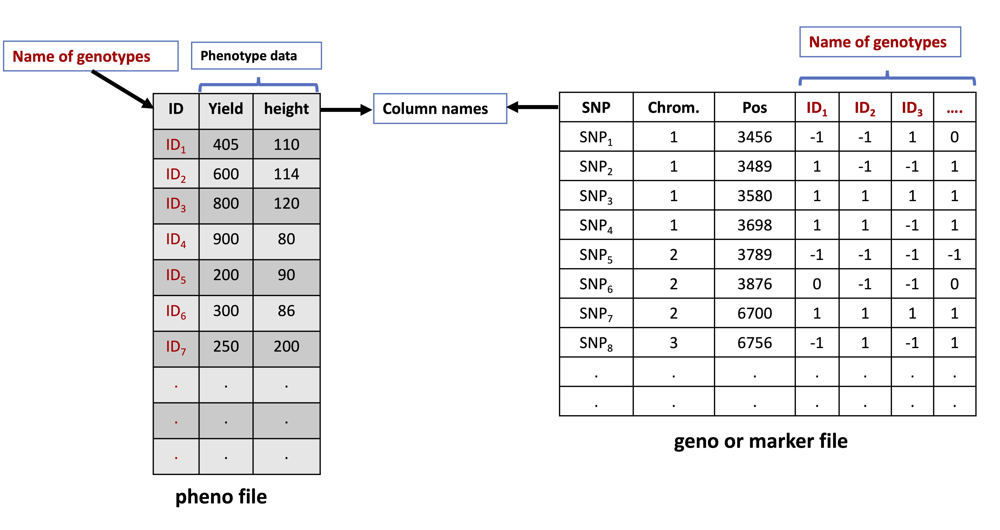
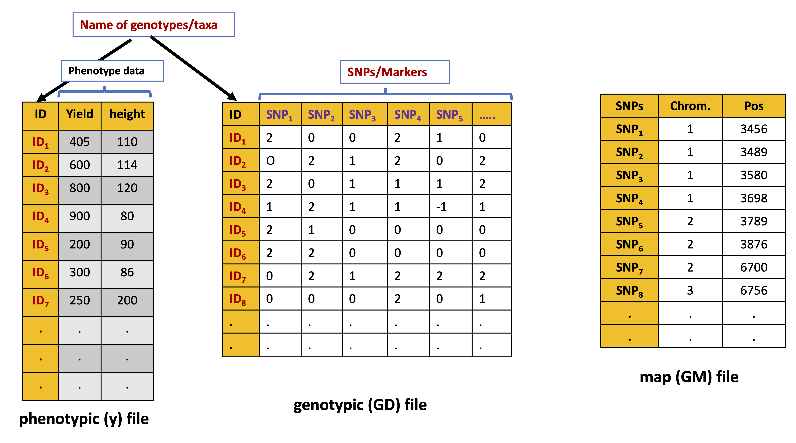

<style type="text/css">

body 
{
   font-size: 18px;
} 
code.r{
  font-size: 18px;
} 
pre {
  font-size: 18px
}

h1.title 
{/* Header 1 */
  font-size: 40px;
  font-family:  "Times New Roman", Times, serif;
  color: black;
   background-color:white;
  text-transform: Capitalize;
} 
h1 { /* Header 1 */
  font-size: 30px;
  font-family: "Times New Roman", Times, serif;
  color: black;
  background-color:#FFF0F5;
  text-transform: none;
} 
h2 { /* Header 2 */
  font-size: 25px;
  font-family: "Times New Roman", Times, serif;
  color: darkblue;
  text-transform: none;
} 
h3 { /* Header 3 */
  font-size: 22px;
  font-family: "Times New Roman", Times, serif;
  color: DarkRed;
  text-transform: none;
} 
h4 { /* Header 4 */
  font-size: 18px;
  font-family: "Times New Roman", Times, serif;
  color: Darkred;
  text-transform: none;
} 

</style>

```{r knitr_init, echo=FALSE, cache=FALSE}
library(knitr)
## Global options
options(max.print="100")
opts_chunk$set(echo=TRUE,
               cache=TRUE,
               prompt=TRUE,
               collapse=FALSE,
               comment=NA,
               strip.white=TRUE,
               message=FALSE,
               warning=FALSE,
               width=65,
               tidy.opts=list(width.cutoff=65, tidy=TRUE))
```

***
**Load the required libraries**

***

```{r, message=FALSE, echo=FALSE}
library(rrBLUP)
library(BGLR)
library(DT)
#library(BGData)
library(qqman)
library(NAM)
library(SNPRelate)
library(ggplot2)
library(ggfortify)
library(poolr)
library(data.table)
```

***
# Data Description

***
**Description of the data**

* Here we will be using rice data available at [http://ricediversity.org/data/index.cfm](http://ricediversity.org/data/index.cfm).
* The marker data includes 44,100 SNP markers for 413 diverse accessions/genotypes of *O. sativa*.
* The phenotypic data includes 34 traits phenotyped for 413 acessions and can be directly downloaded at [link](http://www.ricediversity.org/data/sets/44kgwas/RiceDiversity_44K_Phenotypes_34traits_PLINK.txt).
* The details about data and description of study can be found in manuscript by [Zhao et al (2011)](https://www.nature.com/articles/ncomms1467).

***
### Read the phenotypic data
***

* Data file details:
    + *NFSTV ID represents the name of acessions/genotypes. The names of genotypes are given in numeric 1 to 413. We will paste NSFTV_ to each number to make name unique*.
    + *Total number of traits in the file are 36*
    + *Total number of acessions are 413*
    + *NA represents missing data*
    + *Here we will choose only two traits (seed length and width) for GWAS*
  

```{r}
# Here we will upload the phenotypic data saved in directory.
  rm(list=ls())
  setwd("~/Documents/GitHub/RforPlantBreeding/GWAS_in_R")
  rice.pheno <- read.table("./datafiles/RiceDiversity_44K_Phenotypes_34traits_PLINK.txt",
                         header=TRUE, stringsAsFactors = FALSE, sep = "\t")
# Select the appropriate columns
  rice.pheno<-rice.pheno[, c(2,3,14)]
# Now paste NSFTV_ to each genotype name
  rice.pheno$NSFTVID<-paste0("NSFTV_", rice.pheno$NSFTVID)
# Now drop the ones wih no data
  rice.pheno<-na.omit(rice.pheno)
# check dimensions of data
  dim(rice.pheno)
```

***
### Read the marker data
***
**Description data**

* We will upload the marker data files saved in working directory in datafiles folder.
* The data used here was downloaded from [http://ricediversity.org/data/sets/44kgwas/](http://ricediversity.org/data/sets/44kgwas/). 

* When we unzip the file downloaded from link above, you will find three files **.fam** (contains names about the acessions/genotypes), **.map** (contains map information including chromosome, position and marker name) and **.ped** (conatins the marker allele data in 0, 1, 2, and 3 format; 2 represents missing data). The files are plink converted files.

* 1 represents heterozygous, 0 and 3 represents homozygous for major and minor allele. 

* We will read all the three data files. For reading **.ped** we will use BGLR R package.

* We will recode the marker data to 0 (homozygous, major allele), 1 (Heterozygous) and 2 (homozygous, minor allele) format and missing as NA.

* Finally, we will convert the marker data into matrix and transpose it

```{r}
# Read the .ped file having genotype information
  Geno<-read_ped("./datafiles/sativas413.ped")
  p=Geno$p
  n=Geno$n
  Geno=Geno$x
      
# Now load .fam file haing genotype/acession names
      
  FAM <- read.table("./datafiles/sativas413.fam")
      
# Now read .mpa file containing map information 
      
  MAP <- read.table("./datafiles/sativas413.map")
      
# Let us now recode the marker data in .ped file
  Geno[Geno == 2] <- NA  # Converting missing data to NA
  #Geno[Geno == 0] <- 0   # Converting 0 data to 0
  #Geno[Geno == 1] <- 1   # Converting 1 to 1
  Geno[Geno == 3] <- 2   # Converting 3 to 2
# Now convert the marker data into matrix and transponse and check dimensions
  Geno <- matrix(Geno, nrow=p, ncol=n, byrow=TRUE)
  Geno <- t(Geno)
  dim(Geno)
# Now assign the row and column names to marker file
  colnames(Geno)<-MAP$V2
# Adding line names stored in column second and pasted NSFTV_ID_ to each line name.
  row.names(Geno)<-paste0("NSFTV_",FAM$V2)
```

***
***Additional Information: Reading Marker Data in different formats***

***

- If the marker data is in binary **.bed** format, read it using BGLR R package. More description on **.bed** please check this [Link](https://www.cog-genomics.org/plink/1.9/formats). 

- If **.bed** files are very large, then I  recommend to use R package [BGdata](https://github.com/QuantGen/BGData) to load **.bed** files.  More information see this [Link](https://www.g3journal.org/content/9/5/1377.long). The advantage here is, the package can access genetic data sets stored in hard drives without loading the entire dataset into memory. Make sure you have all the files **.bed**, **.bim**, and **.fam** in the same folder.

- If you have marker data files are in **hapmap** or **VCF** format, I recomed using *NAM* R package to read these files. More details on this can be found here [link](https://cran.r-project.org/web/packages/NAM/vignettes/vignette1.html).

* R package *snpMatrix* can also be used to read **hapmap** file. More details can be found here [link](https://rdrr.io/bioc/chopsticks/f/inst/doc/chopsticks-vignette.pdf).

* Users can also use [TASSEL](https://www.maizegenetics.net/tassel) for conversion of various formats. TASSEL can also be used to convert allele to numeric (0, 1,2) format. 

* R codes to conver nucleotide/allele format to numeric format can be found here [Link]().

***
# Pre-GWAS Filtering
***

***
## Quality Control of Marker Data
***
- Before GWAS, it is importnat to remove the low quality markers. Remember ***"BAD DATA MAY GIVE BAD RESULTS!!"***.
- In this section we will identify and filter the markers based:
  + Outlying missing data across SNPs and Genotypes (call rate).
  + Excessive heterozygosity rate of samples.
  + Check markers deviating from Hardy-Weinberg equilibrium (HWE)
  + Filtering for Minor allele frequency (MAF).
  + Check population structure.
- Note: Filtering conditions based on above parameters will depend on researcher criteria.

- For more details on the qulaity control in GWAS, I highly recomend reading these articles:
  + [Data quality control in genetic case-control association studies](https://www.ncbi.nlm.nih.gov/pmc/articles/PMC3025522/) 
  + [Quality Control Procedures for Genome Wide Association Studies](https://www.ncbi.nlm.nih.gov/pmc/articles/PMC3066182/)
   + [Quality control and statistical analysis](https://onlinelibrary.wiley.com/doi/full/10.1002/mpr.1608) 
   
   + [A guide to genome‐wide association analysis and post‐analytic interrogation](https://onlinelibrary.wiley.com/doi/full/10.1002/sim.6605)


***
### 1. Checking for missing data
***

**Description**

* Call rate represents the proportion of SNPs (or samples) that were genotyped. For example, a call rate of 0.90 for SNP means 10% of the values are missing. Here we will check for SNP call rate and genotype call rate

***
#### a). SNP Call Rate
***
  + Here we will check for missing data across SNPs. We will use apply function to sum the NA's or missing data for each marker and then dividing it by total number of samples/genotypes and multiplying this by 100 to get percentage.
  + Visulaize the missing data as barplot
  + Identify the markers that have more than certain percenatge, for example 25% here.
  + And drop these markers from orginal file
  
```{r, fig.cap="Histogram of missing marker data. X-axis shows missing percenatge and y-axis shows the number of markers that have certain percentage of missing data."}
# Checking missing percentage across snps (SNP call rate)
  miss_snp<- data.frame(SNPs=apply(Geno,2,function(x){
    sum(is.na(x))/nrow(Geno)*100
        })) 
# draw the histogram of missing data
  hist(miss_snp$SNPs, col = "lightblue", xlab = paste("Missing Percenatge"),
     ylab="Proportion of markers", main=NULL)

# Markers which have greater than 25% missing data
  mrt<-which(miss_snp>25)
# Drop these markers from orginnal file and save it 
  Geno<-Geno[, -c(mrt)]
  dim(Geno)
# List of markers that were dropped
  missing_markers<-subset(miss_snp, SNPs>25)
```
***
#### b). Genotype Call Rate
***

  + Here we will check for missing data across genotypes/samples.We will again use apply function to sum the NA's or missing data for each genotype and then dividing it by total number of markers and multiplying this by 100 to get percentage.
  + Visulaize the missing data.
  + Identify the samples that have more than certain percenatge, for example 15% here.
  + And drop these samples from orginal file
  
```{r, fig.cap="Histogram of missing genotype data. X-axis shows missing percenatge and y-axis shows the proportion of genotypes that have certain percentage of missing data. Most of them have less than 5% missing data, but some of the sampples have missing greater than 5% but less than 20%"}

# Checking missing percentage across samples (genotype call rate)
  miss_geno<- data.frame(Genotypes=apply(Geno,1,function(x){
   sum(is.na(x))/ncol(Geno)*100
       }))

# Let us look at the bar plot to get better visualization of missing data across the samples
  hist(miss_geno$Genotypes, col = "lightblue", ylab="Proportion of genotypes", xlab = "Missing Percenatge",main=NULL)
# Identify the samples that have more than 15% missing data
  gen<-which(miss_geno>15)
  Geno<-Geno[-c(gen), ]
  dim(Geno)
# List of samples that were dropped
  missing_genotypes<-subset(miss_geno, Genotypes>15)
  head(missing_genotypes)
```

***
### 2. Checking for heterozygosity across samples
***
+ Here we will check for heterozygosity.We will use again use apply function to sum the number heterozygous calls (rember 1 in genotype data means heterozygous), then divide it by number of markers and multiplying this by 100 to get percentage.
  + Visulaize the heterozygote data.
  + Identify the samples that have more than certain percenatge.
  + And drop these samples from orginal file

```{r, fig.cap="Bar plot and histogram of heterozygosity percentage. In the bar plot X-axis shows genotype names and y-axis shows percentage heterozygosity. Highest heterozygosity is around 4% and few genotyes shows that.In the histogram x-axis shows the heterozygosity percentage and y-axis shows proportion of genotypes having certain heterozygosity"}

# get heterozygous percentage
  htero_geno<-data.frame(htr=apply(Geno,1, function (x){(sum((x==1), na.rm = TRUE)/ncol(Geno)*100)}))

# Visualize using bar and histogram plots
  par(mfrow=c(1,2))
  barplot(htero_geno$htr, xlab="Genotypes", 
          ylab="Heterozygosity percentage", col = "darkblue")
  hist(htero_geno$htr, xlab="Heterozygosity percentage", 
       ylab="Proportion of genotypes", col = "lightblue", main = NULL)

# Here we will not filter for any sample for heterozygosity as it seems reasonable.
  htrg<-which(htero_geno>4)
  Geno<-Geno[-c(htrg), ]
# List of genotypes that were dropped ( one genotype dropped)
  htrg<-subset(htero_geno, htr>4)
  dim(Geno)
```
**Note: Heterozygosity is around 4% that may be reasonable depending upon nature of genotypes. Here for demonstartion purpose we are not filtering any genotypes, thus keep the filtering as 5% which non of the genotype has.

***
### 2. Checking marker heterozygosity (HWE)
***

```{r,fig.cap="Bar plot showing marker heterozygosity percentage. In the bar plot X-axis shows genotype names and y-axis shows percentage heterozygosity. Note, only two markers have more than 10% of heterozygosity and most of them are below 5%."}
# get heterozygous percentage across the markers
  htero_mar<-data.frame(htrm=apply(Geno,2, function (x){(sum((x==1),                  na.rm=TRUE)/nrow(Geno)*100)}))
# Visualize in the bar plot
  barplot(htero_mar$htrm, xlab="Genotypes", 
        ylab="Heterozygosity percentage", col = "darkblue")
# checking the markers with more than 10 % heterozygosity and drop it.
  htrm<-which(htero_mar>30)
  htrm
  Geno<-Geno[, -c(htrm)]
  dim(Geno) # check dimensions of data
# List the markers that were dropped
  htrm<-subset(htero_mar, htrm>30)
  head(htrm)
```
***
### Imputing for Missing Data
***
  
* Here in this section, we will impute the missing marker data. 
* We will simply impute by replacing the missing values with the mean values of each marker.
* There are various methods of imputations which is outside the scope of this topic. Few resource of marker data imputation can be found here

```{r}
# For loop is used to indetify the missing ones and convert them with mean values across columns.
  for (j in 1:ncol(Geno)) {
    Geno[, j] <- ifelse(is.na(Geno[, j]), mean(Geno[, j], 
              na.rm = TRUE), Geno[, j])
  }
```

***
### Checking for Minor allele Frequency
***
+ In this section we will check for minor frequency for the markers. 
+ We will remove the markers that have lower than 5% frequency for minor allele.
+ First let us recall the and see how to calculate the frequencies of alleles:
  +For a bi-alleleic locus (with only two alleles A and B), allele frequenncies represented by p and and q is given as:

**Equation 1**
$$ p= \textit{f} (A)= \frac {2n_{AA} + n_{AB}} {2N} $$
$$ q= \textit{f} (B)= \frac {2n_{BB} + n_{AB}} {2N} $$
where $n_{AA}$,$n_{AB}$, and $n_{BB}$ represent the numbers of AA,AB,and BB individuals, and N represents the total number of individuals in the sample. We divide by $2N$ because each diploid individual has two alleles at a locus. 
+ We will obtian the numerator i.e,  ${2n_{AA} + n_{AB}}$ by using *colsum* function, which will basically add up all the the AA (coded as 2) or AB (coded as 1) in the marker data file.
+ Remember the sum of the allelic frequencies always equals 1 ($p+q=1$); so, after $p$ has been obtained,$q$ can be determined by subtraction:$q=1−p$

+ Note: AA in our marker data file is represented by 2, BB by 0 and AB by 1. 

```{r}
# With Equation one
# Here we will obtain the column sum and divided it by total number of individuals and save it as a data frame.
  p<- colSums(Geno) / (2 * nrow(Geno))
# now get q by subtracting it from 1, we will use ifelse function to subtract if p is greater than 0.5, otherwise it will return p
  q<- ifelse(p > 0.5, 1-p, p)
# get the markers will frequency lower than 5%
  maf <- which(q < 0.05)
# now drop the ones with lower than 5% allele frequency
  Geno <- Geno[,-maf]
  dim(Geno)
```

***
### Saving the files
***
* Here in this section, we will save the final *Geno* file that contains the filtered markers in the .rds format. And also save the final MAP information file.

* Before saving these files, I will match Geno file with phenotypic file to make names of genotypes match ib both files. Note we dropped some genotypes from phenotypic file that does not have data and also genotypes from Geno file while pre-processing.

* Also, we dropped some markers while pre-processing the data, it is required to drop these markers from the *MAP information** so that we make sure we have same markers in both files.

* We will also match the genotypes of geno file with phrnotypic file and save it for GWAS analysis latter. 

```{r}
# Here in this code we are just retaining only those markers in the MAP file that are in filtered Geno file, remeber colnames in geno are the marker names.
  MAP<-MAP[MAP$V2%in%colnames(Geno),]
# Before saving let us check the dimensions and marker are matching in MAP and Geno file.
  table(MAP$V2==colnames(Geno)) # Matching names of markers and putting them in table. All should be true. 
# Let us save MAP file in .rds format
  saveRDS(MAP, file = "./outputfiles/MAP.filtered.rds")
# Now let us match phenotypic and marker data  files
# Here we will match genotype ids
  Geno <-Geno[match(rice.pheno$NSFTVID, rownames(Geno)),]
  dim(Geno)
# 373 genotypes in marker data file are matching
# Phenotypic file has 377
# It means there are 4 genotypes in geno file that are not present in phenotypic file.
  setdiff(rice.pheno$NSFTVID, row.names(Geno))
# First remove these from marker file, they are as missing in marker file
  na.index <- is.na(rownames(Geno))
  Geno <- Geno[!na.index, ]
  dim(Geno)
# Now let us drop these 4 genotypes from phenotypic file
  rice.pheno <-rice.pheno[match(rownames(Geno), rice.pheno$NSFTVID),]
# Check now the names in marker and phenotypic file.
  table(row.names(Geno)==rice.pheno$NSFTVID) # All true, if false then it means not matching.
# Let us save Geno file in .rds format
  saveRDS(Geno, file = "./outputfiles/Geno.filtered.rds")
# Let us save Geno file in .rds format
  saveRDS(rice.pheno, file = "./outputfiles/rice.pheno.filtered.rds")
```

***
## Assesing the Population Structure
***
  - Population structure (PS) which includes ancestry differences or cryptic relatedness, can lead to spurious associatons if allele frequencies vary between subpopulations. 
- Varous methods have been proposed and used to account for PS in GWAS stuudies. For more information on these methods and population structure please check these awesome papers: [Paper 1][https://www.nature.com/articles/nrg1916]; [Paper2](https://journals.plos.org/plosgenetics/article?id=10.1371/journal.pgen.0020190); [Paper 3](https://journals.plos.org/plosgenetics/article?id=10.1371/journal.pgen.1007309); [Paper 4](https://journals.plos.org/plosone/article?id=10.1371/journal.pone.0075707); [Paper 5](https://www.nature.com/articles/nrg2813); [Paper 6](https://link.springer.com/article/10.1007/s00439-019-02014-8)
- In genral PS can be corrected by incorporating the first few principal of genomic relationship matrix as fixed covariates in the GWAS model. However, with this approach, fitting few principal components may not be sufficient to account for complex population structure or family relatedness. Check this paper for more details [Paper](https://journals.plos.org/plosgenetics/article?id=10.1371/journal.pgen.1007309)
-Alternatively,  mixed model approach can be used in which  the whole GRM can be included to account for relationships much better. For more details on this, check this [Paper](https://journals.plos.org/plosone/article?id=10.1371/journal.pone.0075707) 

- In this section we will see how to check the PS using PCA. For that I will be using [SNPRelate](http://corearray.sourceforge.net/tutorials/SNPRelate/)

**Note**: Please note these methods are for demonstration purposes, latter you will see when we will perform GWAS, population structure can be automatically corrected.**

**Description of R Code**: 
* We will use filtered marker data file named as **Geno**. 
* First we will save the rownames (which are basically name of genotypes) and colnames (which are basically marker names). 

* As most of the markers were dropped during pre-processing, it is required to match the name of markers with original map information file to make sure we have right marker names, there position and chromosome numbers which will required here.

* Then we will create a GDS formate file that is required for SNPRelate Package. For more information how to convert the various marker data formates into GDS formate please check this [link](http://corearray.sourceforge.net/tutorials/SNPRelate/#data-formats-used-in-snprelate).

* Finally we will perform PCA analysis and plot it. Importnatly, I highly reccomedn this paper ([Click here](https://academic.oup.com/bib/article-abstract/20/6/2200/5095727)to know more about the PCA in genetic data sets.

- Note: SNPRelate package  has also one option to prune the SNPs based on LD between markers to avoid the clustering of same markers for more accurate PCA analysis.  Please see this [link](http://corearray.sourceforge.net/tutorials/SNPRelate/#ld-based-snp-pruning) for more details. 

```{r}
# Save the name of genotypes which are given in rows of GENO file
  names.genotypes<-rownames(Geno)
  length(names.genotypes)
# Now save the name of markers which are given in columns of GENO
  names.markers<-colnames(Geno)
  length(names.markers)
# Let us create GDS fomate file required for SNPRelate Package
  snpgdsCreateGeno("geno.gds", genmat = Geno, sample.id =names.genotypes , snp.id=names.markers, snp.chromosome = MAP$V1, snp.position = MAP$V4, snpfirstdim = FALSE)
# Now open this file
  geno.gds <- snpgdsOpen("geno.gds")
# check the summary to see if everything is correct.
  snpgdsSummary("geno.gds")
# Now let us perform the PCA analysis
  pca.geno<- snpgdsPCA(geno.gds, 
                       snp.id = colnames(Geno), remove.monosnp=TRUE) 
# Here we can also filter for missing and MAF if needed. Check arguments. 
# Variance proportion
  head(round(pca.geno$varprop*100,2))
# Let us extract the PC components and save it as csv
  pca.data<- data.frame(sample.id = pca.geno$sample.id,
                      EV1 = pca.geno$eigenvect[,1],    # the first eigenvector
                      EV2 = pca.geno$eigenvect[,2],    # the second eigenvector
                      EV3 = pca.geno$eigenvect[,3],
                      EV4 = pca.geno$eigenvect[,4],
                      EV5 = pca.geno$eigenvect[,5],
                      stringsAsFactors = FALSE)
  head(pca.data)
  
# Add the population information to pca.data file.
# Borrowing the population information from pca data file available on web.
# Read pca file from web and save it as pca.webdata
  pca.webdata<- read.csv("http://ricediversity.org/data/sets/44kgwas/RiceDiversity.44K.germplasm.csv", header = TRUE, skip = 1, stringsAsFactors = FALSE)  # 431 x 12
# Chnage the name formate of the genotypes by pasting "NSFTV_ID_" to each line
  pca.webdata$NSFTV.ID<-paste0("NSFTV_", pca.webdata$NSFTV.ID)
# Now let us match this file with our file pca.data file.
  pca.webdata<- pca.webdata[match(pca.data$sample.id, 
                                  pca.webdata$NSFTV.ID), ]
  table(pca.data$sample.id == pca.webdata$NSFTV.ID) 
# here we will check wether the names are similar.

# Now let us add this population information to our pca.data file
  pca.data <- cbind(pca.webdata$Sub.population, pca.data)
  colnames(pca.data)[1] <- "Sub.population" # rename first column
# Save the pca file in output directory
#write.csv(pca.data, file="./outputfiles/PCA/pca.data.csv",row.names = FALSE)
# Visualize the PCA plot using ggplot.
  ggplot(pca.data,aes(x=EV1,y=EV2, color=Sub.population))+
  geom_point(size=2)+
    geom_hline(yintercept=0.00, linetype="dashed", color = "black")+
    geom_vline(xintercept=0.00, linetype="dashed", color = "black")+
    theme_minimal()+
    scale_color_manual(values = c("blue", "skyblue", "darkred", "pink", "gray", "green"))+
    labs(title = "", x=paste(round((pca.geno$varprop*100)[1],2)),y=paste(round((pca.geno$varprop*100)[2],2)))+ # here adding varaince contribution to x and y-axis.
    theme(plot.title = element_text(color="black",size=12, hjust=0.5))+
  theme(axis.text.x=element_text(colour='black', size=12)) + #asthetics of x-axis text
  theme(axis.text.y=element_text(colour='black', size=12)) + #asthetics of y-axis text
  theme(axis.title.x = element_text(colour='black', size=12, vjust=0.0)) + #asthetics of x-axis title
  theme(axis.title.y = element_text(colour='black', size=14))+
  theme(legend.title = element_text(colour="black", size=14),
        legend.text = element_text(colour="grey0", size=12))+
  guides(fill=guide_legend(title="Sub Populations"))
      
```

# GWAS Analysis


* Here in this section GWAS will be performed. I will show how to perfrom GWAS in **[rr BLUP](https://acsess.onlinelibrary.wiley.com/doi/full/10.3835/plantgenome2011.08.0024)** package and in **[GAPIT](https://github.com/jiabowang/GAPIT3)** packages.

## GWAS in rrBLUP

* GWAS in rrBLUP is  based on the mixed model proposed by [Yu et al. 2006]((https://www.nature.com/articles/ng1702), and as described above in the Statistical Model Section. [Click here for more desdription](https://rdrr.io/cran/rrBLUP/man/GWAS.html).

### Preparing Data files for rrBLUP

* To do GWAS in rrBLUP, we need the Phenotypic data (called as pheno file in rrBLUP), marker data (called as geno file in rrBLUP). ***The screenshort of Pheno and geno file is given below***:



* Pheno file should be a dataframe with first column as genotype names/id and rest of columns as phenotye data values.Co-variates can also be added to same dataframe and should be designated. 

* Marker data file should 
  - Contain the marker names in the first column. 
  - The second and third columns should contain the chromosome and position of markers (either bp or cM), respectively. 
  - Columns 4 and higher contain the marker scores for each genotype. ***Note: in rrBLUP marker/SNP data is coded scored read as {-1,0,1}. 1 is homozygous for major allele equal to AA or 2 in our file which we used above,  -1 is homozygous for minor allele (0 or BB) and 0 is heterozygous for both alleles (0, or AB)***. 
  - Fractional (imputed, like converting missing values into mean, as done above in imputation section) and missing (NA) values are allowed in rrBLUP. 
  - The column names must match the line names in the "pheno" data frame.

* Here we will prepare the pheno and geno files in rrBLUP format and use them for GWAS analysis. 
* The data file we are working with is in {2,1,0} format, we need to convert it into {-1,0,1} by subtracting 1 from each [2-1=1, 0-1=-1, and 1-1=0). Also we need to transpose the data file to make sure markers are in rows and genotypes in columns to match the rrBLUP GWAS format. Check the code for more description.


```{r}
  rm(list=ls())
# First let us upload the filtered marker data file in gds format.
  marker.data.filtered<-readRDS(file = "./outputfiles/Geno.filtered.rds")
  dim(marker.data.filtered) # 408 genotypes in rows and 33088 markers in columns
# check first 6 rows and columns
  marker.data.filtered[1:6, 1:6]
# Here in this file,  markers are in columns and genotypes in rows. Also it is in 0, 1 and 2 format. 
# Read the filtered map information file and add to marker  data file.
  map.info<-readRDS(file = "./outputfiles/MAP.filtered.rds")
  dim(map.info)
# Now let us prepare the rrBLUP format GWAS file
# Here we will add marker names, position and chromosome no. from map file, then marker.data file which is transposed and also subtracted -1 (2-1=1,0-1=-1,1-1=0)
  geno.rice<- data.frame(marker = map.info[, 2], chrom = map.info[, 1], pos = map.info[, 
    4], t(marker.data.filtered - 1), check.names = FALSE)  # W = \in{-1, 0, 1}
#  View as data table few rows and columns
# Now let us upload the pheno file
  rice.pheno<-readRDS(file = "./outputfiles/rice.pheno.filtered.rds")
  dim(marker.data.filtered)
```

### Run GWAS in rrBLUP

* In this we will perform GWAS for seed length trait only.

* In rrBLUP GWAS is done using **GWAS function**. The various arguments of that function are:

    - ***GWAS(pheno, geno, fixed=NULL, K=NULL, n.PC=0,min.MAF=0.05, n.core=1, P3D=TRUE, plot=TRUE)***.
    
* The details on these arguments can be found here at this [link](https://rdrr.io/cran/rrBLUP/man/GWAS.html) or by running **?rrBLUP** command, it will directly pop-up the help page and description about GWAS function in rrBLUP. directly

* The output returned after GWAS analysis is a dataframe with first column as (marker names), second (chromosome name), third (position of chromosome), and fourth column (-log10(p) value).

```{r}
# Run the GWAS analysis
  gwas<-GWAS(pheno=rice.pheno[,c(1,3)],geno=geno.rice, fixed=NULL, P3D = TRUE, plot =FALSE)
# Visulaize the gwas dataframe(gwas)
# Data table
# Save the results in the directory
# Let us save Geno file in .rds format
  saveRDS(gwas, file = "./outputfiles/GWAS_output_rrBLUP/gwas.rds")
# Visualize top significant SNPs
  gwas[gwas$Plant.height>5,]
```

# Post- GWAS Analaysis

### Multiple Testing

* Multiple testing or multiple comparison refers to a situation where a dataset is subjeted to statistical tests multiple times. More details and further readings on this can be found in here: [Resource 1](https://www.ncbi.nlm.nih.gov/pmc/articles/PMC5506159/),
[Resource 2](https://bmcgenomics.biomedcentral.com/articles/10.1186/1471-2164-11-724), [Resource 3](https://www.ncbi.nlm.nih.gov/pmc/articles/PMC4840791/) and [Resource 4](https://www.statisticshowto.com/multiple-testing-problem/).

* In above GWAS we fitted regression analysis for each marker (single marker analysis) seperately resulting about 33088 (no. of markers) marker tests leading to a multiple testing problem. Multiple testing actually increases or inflates the probability of incorrectly rejecting a true $Null hypothesis: H0$ (Type 1  error)  and we need to adjust for it.

* For example if we are conducting ***n*** tests, the probability of making one error in ***n*** tests is: $p=1-(1-\alpha)^n$. If $\alpha$=0.05 and $n$=1, then $p$=0.05. However, with $n$ or number of markers in ten thousands or millions this probability of error increases significantly. 

* Various approaches have been used to account for multiple testing and determine the genome-wide significance level. 
* These include **Bonferroni Correction, False Discovery Rate(FDR, for example Benjamini and Hochberg) and permutation tetsing.** More details on these can be found in this [paper](https://www.ncbi.nlm.nih.gov/pmc/articles/PMC5506159/). For example in **Bonferroni Correction** new level of significance is given as:$\alpha^`= \frac{\alpha}{n}$, where $n$ is number of tests or markers. In our case, $\alpha^`= 0.05/33088 = 0.000015$.  So any marker having $p-value$ less $0.000015$ would be declare significant. The disadvantages with this is it is stringent criterion and highly conservative (increase the proportion of false negatives) , imagine when we have millions of markers to run and or markers are correlated. 

* Further, in marker data many markers/SNPs may be correlated due to **Linkage disequilibrium (LD)**, thus by definition are not independent, thus need other approaches to account for LD between markers in declaring genome-wide significance level.


* [Li and Ji (2005)](https://www.nature.com/articles/6800717) gave a procedure to account for LD between markers and calculate the number of independent markers or what they called effective number of tests ($M_{eff}$). The procedure they proposed is given below:

    - **Step1**: Construct a Correlation Matrix between markers (can be done chromosome -wise if number of markers are huge).
    
  - **Step2**: Estimate the effective number ($M_{eff}$) of independent tests by running PCA on correlation matrix.
    
  - **Step3**: Adjust the significance threshold through Sidak (1967) correction as:
  $\alpha_{p}= 1-(1-\alpha_{e})^\frac{1}{M_{eff}}$, here $\alpha_{p}$ is the adjusted level of significance, $\alpha_{e}$ is orginal level of significance (usually 0.05) and M_{eff} is number of effective tests. 
  
  - **Step4**: Any marker that has $p$-value below the $\alpha_{p}$ is declare significant or associated with trait of interest. 


### Multiple testing using Li and Ji (2005)

* Here we determine the ($M_{eff}$) using the [**poolr**](https://ozancinar.github.io/poolr/) R package.  Besides, the Li and Ji (2005) procedure, the package has other procedures also to calculate $M_{eff}$. 

* Once we calculate $M_{eff}$, we will use this to calcualte the genome-wide significance level as a threshold using  [Sidak Correction](http://www.cogsci.ucsd.edu/~dgroppe/STATZ/Abdi-Bonferroni2007-pretty.pdf) to declare significant marker trait-associations.

* Note as we are dealing with large markers it is better to calculate $M_{eff}$ per chromosome to avoid computational burden and memomary limitations.

```{r, eval=FALSE}
# First let us get infomation on number of marker on each chromosome.
# We use this informtion to get correlation matrix for each chromosome.
  table(gwas$chrom)
# Now calculate correlation matrix between markers for each chromosome
# For example, chr 1 has 5837 marker from column 1 to 5837
  corr.matrix.chr1 <- cor(marker.data.filtered[,1:5837]) 
  corr.matrix.chr2 <- cor(marker.data.filtered[,5838:9352])
  corr.matrix.chr3 <- cor(marker.data.filtered[,9353:13323]) 
  corr.matrix.chr4 <- cor(marker.data.filtered[,13324:15908]) 
  corr.matrix.chr5 <- cor(marker.data.filtered[,15909:18488]) 
  corr.matrix.chr6 <- cor(marker.data.filtered[,18489:21418]) 
  corr.matrix.chr7 <- cor(marker.data.filtered[,21419:23321])
  corr.matrix.chr8 <- cor(marker.data.filtered[,23322:25368])
  corr.matrix.chr9 <- cor(marker.data.filtered[,25369:27172])
  corr.matrix.chr10 <- cor(marker.data.filtered[,27173:28772])
  corr.matrix.chr11 <- cor(marker.data.filtered[,28773:31351])
  corr.matrix.chr12 <- cor(marker.data.filtered[,31352:33269])
# Calculate effective number of independent tests.
  meff.chr1 <- meff(corr.matrix.chr1, method = "liji")
  meff.chr2 <- meff(corr.matrix.chr2, method = "liji")
  meff.chr3 <- meff(corr.matrix.chr3, method = "liji")
  meff.chr4 <- meff(corr.matrix.chr4, method = "liji")
  meff.chr5 <- meff(corr.matrix.chr5, method = "liji")
  meff.chr6 <- meff(corr.matrix.chr6, method = "liji")
  meff.chr7 <- meff(corr.matrix.chr7, method = "liji")
  meff.chr8 <- meff(corr.matrix.chr8, method = "liji")
  meff.chr9 <- meff(corr.matrix.chr9, method = "liji")
  meff.chr10 <- meff(corr.matrix.chr10, method = "liji")
  meff.chr11 <- meff(corr.matrix.chr11, method = "liji")
  meff.chr12 <- meff(corr.matrix.chr12, method = "liji")
# Now add all the effective tests to get total number of effective/independent tests
  Meff <- sum(meff.chr1,meff.chr2,meff.chr3,meff.chr4,meff.chr5,meff.chr6,meff.chr7,meff.chr8,meff.chr9,meff.chr10,meff.chr11,meff.chr12)
Meff # Meff is 3733

# Before proceding further let us remove these big files first which we do not need now.
# removing meff files
  rm(meff.chr1,meff.chr2,meff.chr3,meff.chr4,meff.chr5,meff.chr6,meff.chr7,
            meff.chr8,meff.chr9,meff.chr10,meff.chr11,meff.chr12)
# removing corr.matrix files
  rm(corr.matrix.chr1, corr.matrix.chr2,corr.matrix.chr3, corr.matrix.chr4,corr.matrix.chr5,
   corr.matrix.chr6,corr.matrix.chr7,corr.matrix.chr8,corr.matrix.chr9,corr.matrix.chr10,
   corr.matrix.chr11,corr.matrix.chr12)
```

#### Determine Significance Threshold Level

* Here Significance threshold level will be determined using following equation and as described above: 

\[
  \alpha_{p}= 1- (1- \alpha{e})^1/Meff\\
  \alpha_{p} =\text {is the adjusted level of significance}\\
  \alpha_{e}= \text{is orginal level of significance (usually 0.05)}\\
  Meff= \text {is the effective number of independent tests}\\
  
  \]
  
```{r}
  meff<-3733 # was calculated above
  p_threshold= (1- (1-0.05))^1/3733 # p-value to use as threshold for significance
  p_threshold
# -log10
-log10(p_threshold)
```

**Thus the p-value of $1.339405e-05$ or $-log10(p-value)= 4.87$ will be used as threshold for significance. Any marker with p-value $<1.339405e-05$ or $-log10$ > 4.87 is decleared significant.**

### Manhattan and QQ plot.

* Here in this section Manhattan Plot and QQ plot will be Drawn using [qqman](https://joss.theoj.org/papers/10.21105/joss.00731) R package.

* Manhattan plot is used to Visualize the GWAS results. Additional details on thus [Click here [1](https://www.r-graph-gallery.com/101_Manhattan_plot.html) and [2](https://genome.sph.umich.edu/wiki/Code_Sample:_Generating_Manhattan_Plots_in_R).

* For quantile-quantile (QQ) is graphical representation of the deviation of the observed ($p$ values for each SNP are sorted from largest to smallest in QQ plot)  $p$-values with expected $p$ values. QQ plot is a great tool in detecting the problems in a GWAS results and model fit. In QQ plot if the observed values correspond to the expected values, all points are on the middle line. If some observed $p$ values are significant than points at tail will move towards the y-axis of QQ plot. If any seperation of observed $p$ values from the midle lines other than at tail is observed this means an issue with GWAS and likely  due to population structure, which may have not be accounted correctly in GWAS model. More details on QQ plot check the following resources [Resource 1, check qq plot section](https://www.ncbi.nlm.nih.gov/pmc/articles/PMC2865585/) and [PPT, check section QQ plot](https://physiology.med.cornell.edu/people/banfelder/qbio/resources_2013/2013_1_Mezey.pdf)

```{r}
# Draw the Manhattan plot and save it in folder
# Here we will use threshold for significance of -log10 of 4.8 as determined in Mul.testing.
# Save it as high-resolution plot 
#png("./outputfiles/plots_rrBLUP/Manhattan.png",width=7, height = 6, units = 'in', res =500)
  manhattan(x=gwas, chr = "chrom", col = c("gray", "skyblue", "pink"),  bp="pos", p="Plant.height", snp="marker", logp=FALSE, genomewideline= FALSE, ylim=c(0,7), suggestiveline= -log10(1.339405e-05), cex.axis = 0.8, mgp=c(2,1,0))
#dev.off()
```


# GWAS in GAPIT

* [GAPIT](https://www.maizegenetics.net/gapit) is a powerful tool to perform GWAS ( [Lipka et al. 2012](https://doi.org/10.1093/bioinformatics/bts444) nand [Tang et al. 2016](https://doi.org/10.3835/plantgenome2015.11.0120). It has a flexibility to apply various Statistical methods for GWAS analysis and can easily handle large data sets. 

* The various GWAS statistical methods implemented in GAPIT are: [GLM](https://www.genetics.org/content/155/2/945),  [Q+K method](https://www.nature.com/articles/ng.546) (same as in rrBLUP described above), [Compressed MLM](https://bmcbiol.biomedcentral.com/articles/10.1186/s12915-014-0073-5), [MLMM](https://www.nature.com/articles/ng.2314), [FarmCPU](https://doi.org/10.1371/journal.pgen.1005957) and [BLINK](https://doi.org/10.1093/gigascience/giy154).  

* For the latest manual and details on GAPIT Click here [Latest Manual](http://www.zzlab.net/GAPIT/gapit_help_document.pdf) and [Github Demo](https://github.com/jiabowang/GAPIT3). 

* **Youtube Videos** showing GWAS analysis in GAPIT is also available at GAPIT Tutorial ([Part 1](https://www.youtube.com/watch?v=2VjX1QsRjw0), [Part 2](https://www.youtube.com/watch?v=Sw8xInJvqXU), and [Part 3](https://www.youtube.com/watch?v=KlLT5R47ydE)) and [GWAS Tutorial-IRRI](https://www.youtube.com/watch?v=SQlOhJW7H80&t=2626s). I highly recommedn in watching these videos.

### Installing and using GAPIT

* To use GAPIT we need to upload the source code by running these commands $source("http://zzlab.net/GAPIT/GAPIT.library.R")$ and 
$source("http://zzlab.net/GAPIT/gapit_functions.txt")$. And also needs to install and load some additional R packages ($gdata$,$multtest$, $gplots$, $LDheatmap$, $genetics$,$ape$, $EMMREML$, $compiler$ (already available in R no need to install), and $scatterplot3d$) required by GAPIT. 

* [multtest](https://www.bioconductor.org/packages/release/bioc/html/multtest.html) is [Bioconductor](https://www.bioconductor.org/install/#install-bioconductor-packages) Package and to install it we need $BiocManager$. For installation of these packages please see the script below:

* Alternatively GAPIT is now available on Github as **GAPIT3** R package. Here, I will be using GAPIT3 package for GWAS.

**Install and Load GAPIT and Dependencies**

```{r}
# First remove previous files
  rm(list=ls())
# install multtest
#if (!requireNamespace("BiocManager", quietly = TRUE))
 # install.packages("BiocManager")
#BiocManager::install("multtest")
# Here I will use a code to install the package if not installed and load.
#packages = c("MASS", "gdata", "LDheatmap", "genetics", "ape","EMMREML", "multtest")
      #package.check <- lapply(packages, FUN = function(x) {
        #if (!require(x, character.only = TRUE)) {
          #install.packages(x, dependencies = TRUE)
          #library(x, character.only = TRUE)
       # }
      #})
# Now load all these R packages along with GAPIT source functions
#source("http://zzlab.net/GAPIT/gapit_functions.txt")
#source("http://zzlab.net/GAPIT/emma.txt")

# Intsalling GAPIT
#install.packages("devtools")
#devtools::install_github("jiabowang/GAPIT3",force=TRUE)
  library(GAPIT3)
```

### Data files and format for GAPIT

* GAPIT accepts both ***[Hapmap](http://augustogarcia.me/statgen-esalq/Hapmap-and-VCF-formats-and-its-integration-with-onemap/)*** and ***Numeric format*** files for GWAS. Check the [refrence manual](http://www.zzlab.net/GAPIT/gapit_help_document.pdf) for more details. Briefly;

* Here we will be using Numeric format as did in rrBLUP analysis.

* For GWAS using numeric format 3 files are required : 1) Phenotypic Data (Y) file, 2) Genotypic Data (GD) file, and Map info (MD) file. See the demo below: 




* Phenotypic file (called as Y) contains the first column as genotype/taxa IDs and the remaining columns should contain phenotypes/traits for GWAS. Missing data is indicated by either “NaN” or “NA”. Following commond is used to read phenotypic file:

\[
Y <- read.table("phenotypic.data.txt", head = TRUE)
\]

* Genotype data (called as "GD") have marker data in ${2,1,0}$ format, with first column as genotype/taxa IDs  and first row as header containing SNP Ids. ollowing commond is used to read phenotypic file:

\[
GD<- read.table("genotypic.data.txt", head = TRUE)
\]

* The map file (called as “GM”) contains SNP Ids in first column, chromosome no. in second column and third column shows position of SNPs.

\[
GM <- read.table("map.data.txt", head = TRUE)
\]

**Reading Data files for GWAS** 

* Note: You can use the already upoaded files used in rrBLUP for analysis. These files are in saved as *.rds* files.  However, for demo purpose I have saved these files in the folder as *.txt* files and will use that for GWAS in GAPIT.

```{r, eval=FALSE}
# Read the phenotypic data file
  pheno<- readRDS("./outputfiles/rice.pheno.filtered.rds")
  dim(pheno)
# Select the plant height trait onlu
  pheno<-pheno[, c(1,3)]
# Convert genotype id's as fcators
  pheno$NSFTVID<-as.factor(pheno$NSFTVID)
# Read the genotypic/marker file
  geno<- readRDS("./outputfiles/Geno.filtered.rds")
# Read the map info file
  map.info<- readRDS("./outputfiles/MAP.filtered.rds")

# Let us cross check wether genotype names are matching
  table(pheno$NSFTVID==row.names(geno)) # TRUE, means matching
```

### GWAS Analysis

* Here in this section GWAS will be performed. Note, as mentioned earlier in GAPIT we can fit many Statistical models ($"GLM","MLM","SUPER","MLMM","FarmCPU","Blink"$) to perform GWAS. For demo purpose I will be using only one method i.e., **MLM**.  For more details on this please check the [GAPIT Manual](http://www.zzlab.net/GAPIT/gapit_help_document.pdf) or [GitHub page](https://github.com/jiabowang/GAPIT3#gwas). 

* Further I will use few arguments in GAPIT functions, for more arguments check the manual. 

* Also, I will first set a working directory to save the GWAS results. GAPIT will directly save all the output files(*check the section 4.1 to 4.15 the output files GAPIT returns*) in the setting working directory.


```{r, eval=FALSE}
#Set working directory
  setwd("./outputfiles/GWAS_output_GAPIT")
#pheno<-pheno[,c(1,3)]
# Now run the analysis
  gwas.output<- GAPIT(
  Y=pheno, # phenotypic data file, run only for traits in column 2. If not mentioned it will run gwas for all traits. Column 1  contains genotype names.
  GD=geno, # genotypic/amrker data file
  K=NULL,
  GM=map.info, # map file
  PCA.total=6, # PC components equal (Q+K) model
  SNP.P3D=TRUE, # variance calculated single time
  model="MLM" # Model is Mixed Linear model as used in rrBLUP
)
# MLM model incorporates Kinship matrix automatically. 
# Kinship matrix (Z) can aslo be incorporated manually and covariates.
```
Note: Here I just use MLM model only with few arguments in GAPIT, for more arguments check the manual. 
### GAPIT OUTPUT
* Also, I will first set a directory to direct and save the output. GAPIT will directly save all the output files(*check the section 4.1 to 4.15 the output files GAPIT returns*) in the setting or current working directory.

* GAPIT returns and saves lot of files directly in the working directory. It return for example VanRanden plot, PCA plot, Eigen Values, Marker heterozygosity, Marker density, LD of markers, Manhattan plot chromosome wise and whole genome and more. 

* One importnat output file is **GWAS Results file** in .csv format. In this file you will find columns "*Marker name*, 	*Chromosome*, 	*Position*,  	*P.value*, 	*Minor allele frequency (maf)*, 	*number of observations (nobs)*, 	*Rsquare.of.Model.without.SNP*,	*Rsquare.of.Model.with.SNP*, 	*FDR_Adjusted_P-values*,  and	*effect of marker*.

* Note: To get actual variation contribution of marker ($R{^2}$) to total varaition, users need to subtarct *Rsquare.of.Model.with.SNP* from *Rsquare.of.Model.without.SNP*.

* Further the p-values can be used to plot the Manhattan and QQ plot in similar way as shown in section above. Also users can determine the significance threhold level similar as shown in above section. GAPIT uses FDR to determine Significance threshold level.

***
<span style="color: darkred;font-size: 20pt;font-family: fantansy">*For any suggestions or comments, please feel to reach at waseem.hussain@irri.org; waseemhussain907@gmail.com*</span>
***

***
<span style="color: blue;font-size: 20pt;font-family: fantansy"> Next comming is a step-by-step approach to perform **GWAS using Bayesian Approach, and Fitting all Markers Jointly and Multi-trait GWAS**</span>

***

^[More to follow on R for Plant Breeding](https://github.com/whussain2/R-for-Plant-Breeding)

