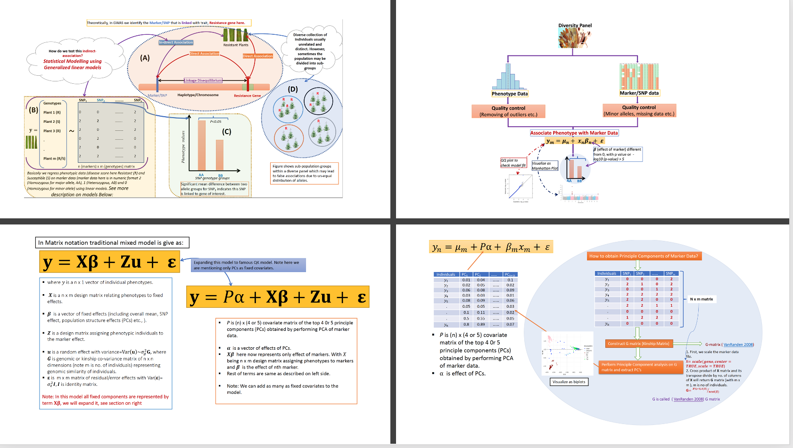

# Learning GWAS

- This folder contains the tutorials for learning the GWAS. 
- The **first HTML file** is on **Understanding the GWAS**. It includes basic concepts of GWAS, statistical models and workflow. 
 - All the literature relevant to GWAS is given as hyperlinks in HTML file. 
 - **Second HTML file** shows the demo of GWAS in [rrBLUP](https://cran.r-project.org/web/packages/rrBLUP/index.html) and [GAPIT](https://zzlab.net/GAPIT/) R packages 
 
 
#  Source code and Document

***
## 1. Understanding GWAS (Theory)
***

- The HTML file is available here [GWAS Theory](https://htmlpreview.github.io/?https://github.com/whussain2/R-for-Plant-Breeding/blob/master/GWAS_in_R/GWAS_in_R_Step_by_Step_Guide.html)

- The source in ****.Rmd****  is available here [GWAS Theory (.rmd file)](https://github.com/whussain2/R-for-Plant-Breeding/blob/master/GWAS_in_R/GWAS_in_R_Step_by_Step_Guide.Rmd)

***
## 2. GWAS Demo in R
***

- Detailed and step-by-step approach for GWAS analysis in **rrBLUP** package and in **GAPIT** R packages is given. 

- The source code in ****.Rmd****  is available here [GWAS R Workflow](https://github.com/whussain2/R-for-Plant-Breeding/blob/master/GWAS_in_R/Hands_On_GWAS_R.Rmd)

- The HTML file is available here [GWAS R Workflow ](https://htmlpreview.github.io/?https://github.com/whussain2/R-for-Plant-Breeding/blob/master/GWAS_in_R/Hands_On_GWAS_R.html)

# How to Use the Source Codes and Run the Pipeline

The steps to use the source codes and run it on local computer is given below:

- Open the GitHub page containing the source codes and files by using clicking the link [https://github.com/whussain2/R-for-Plant-Breeding](https://github.com/whussain2/R-for-Plant-Breeding).
- This will pop-up the Github repository, click on the **Code** button on right side of page highlighted as green box and scroll and click on **Download Zip**.
- Save and unzip the downloaded repository in local drive.
- Set **GWAS_in_R** as your working directory in R  
- Open the ***.Rmd*** file in R Studio and make sure to change the working directory based on users defined path to the repository.
- For opening HTML files, just open them in any browser. 

- Also users must install and upload the following R packages before running the pipeline:

# Contact
You may contact the author of this code, Waseem Hussain at <waseem.hussain@irri.org>; <waseemhussain907@gmail.com>
***

 

 
This is the part of the open resource initaitive and learning platform **R for Plant Breeding**  to learn the Plant Breeding and Genetics related data analysis and visualizations in R.
Follow at [FaceBook](https://www.facebook.com/groups/572539569836593) and [Twitter](https://twitter.com/rPlantBreeding1)
